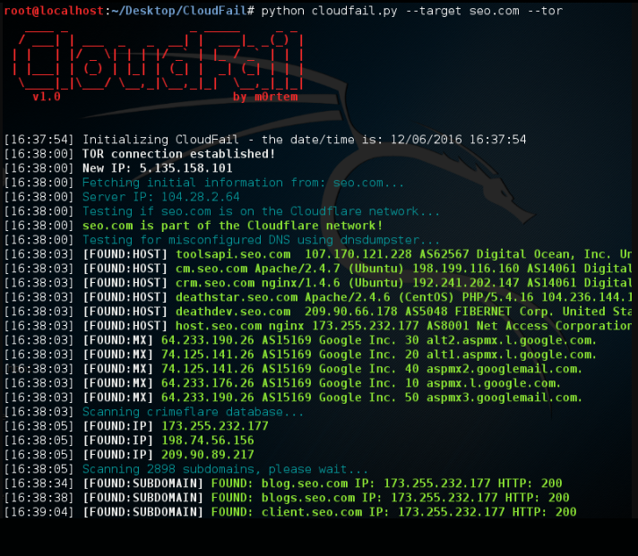

# CLOUDflare-Real-IP
<h1>This script find the server or public IP address used by cloudflare's spoofing</h1>

This is a reconnaissance tool that aims to gather enough information about a target protected by Cloudflare in the hopes of discovering the location of the server. Using Tor to mask all requests, the tool as of right now has 3 different options/phases.
<ol>
<li>Misconfigured DNS scan using DNSDumpster.com.</li>
<li>Scan the Crimeflare.com database.</li>
<li>Bruteforce scan over 2500 subdomains.</li>
</ol>

<h1>Install on Kali/Debian</h1>
<ol>
<li>$ sudo apt-get install python3-pip</li>
<li>$ pip3 install -r requirements.txt</li>
</ol>
<H1>USAGE</H1>
python3 cloudfail.py --target EXAMPLE.com

------------------------------------------------
To run a scan against a target using Tor:

service tor start
------------------------------------------------

<H1>Dependencies</H1>
<ul>
<li>Python3</li>
<li>argparse</li>
<li>colorama</li>
<li>socket</li>
<li>binascii</li>
<li>datetime</li>
<li>requests</li>
<li>win_inet_pton</li>
</ul>

BY:
.-.-. .-.-. .-.-. .-.-. .-.-.  
'. S )'. L )'. I )'. C )'. E ) 
  ).'   ).'   ).'   ).'   ).'  
                             

